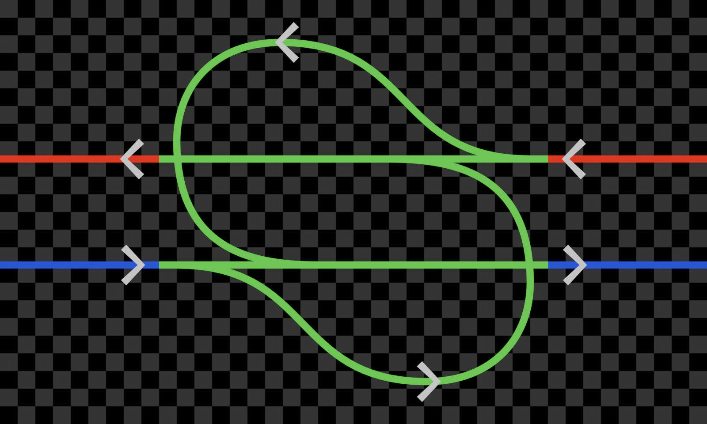

# The ELR Manual

The ELR Manual is a comprehensive collection of standards for all things
train and track. The Manual includes descriptions, measurements, and
diagrams of every standardized component of the Dragongirlserver rail
network. To assist in navigation, the table of contents will give a point
of reference for all subjects the Manual covers.

## Table of Contents

- [0: Index](./index)
- [1: Trains](./trains)
- [2: Tracks](./tracks)

## Reading the Manual

This manual incorporates several patterns that the reader should be aware
of.

First of all, this manual uses metric units for all measurement. Most
commonly, the manual presents distances and lengths in meters (As a
reminder, one block is a one meter cube).

Second, throughout this manual, diagrams will be provided to assist
understanding. It's important to understand these diagrams and how to read
them in order to understand what they are communicating.

This is an example of the kind of diagrams that are often used to describe
track layouts.

In the background of the image, you can see a grid of
squares. These squares represent 1m (1 block) in the world. Diagrams
showing designs in the world will always be block aligned.

On top of the background, there are several curves. These curves represent
tracks. ELR uses standard-gauge rail on all non-specialty lines, so for
readers wishing to use wide- or narrow-gauge tracks instead, the diagrams
will not be block-accurate and must be scaled up.

Finally, on top of the curves there are several white arrows. These arrows
represent signals. Each arrow points in the direction the signal should be
facing, and is placed on the block the signal should be positioned at
(with curved tracks this is more of an estimate). Additionally, track
segments are coloured distinctly for each signal section they belong to.
This visualization mirrors the visualization shown when holding a signal
block.

<!--
TODO:
- Section about block diagrams, e.g. the station one and potentially train ones.
-->