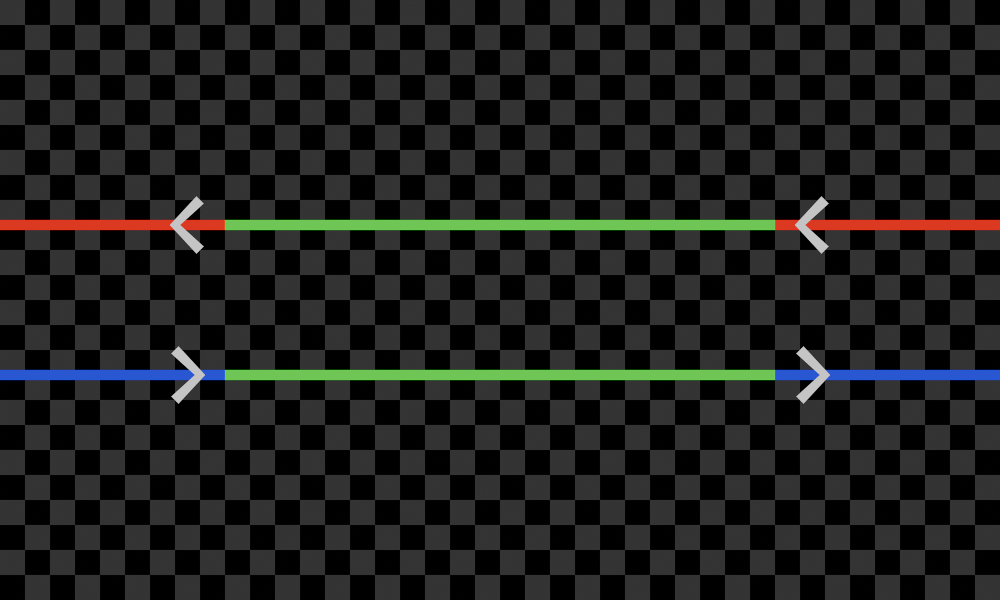
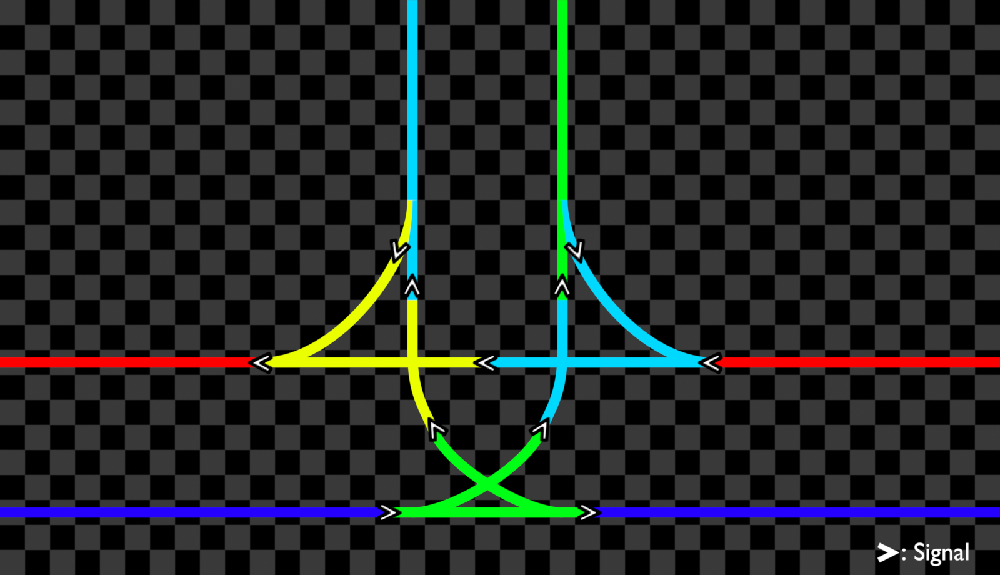
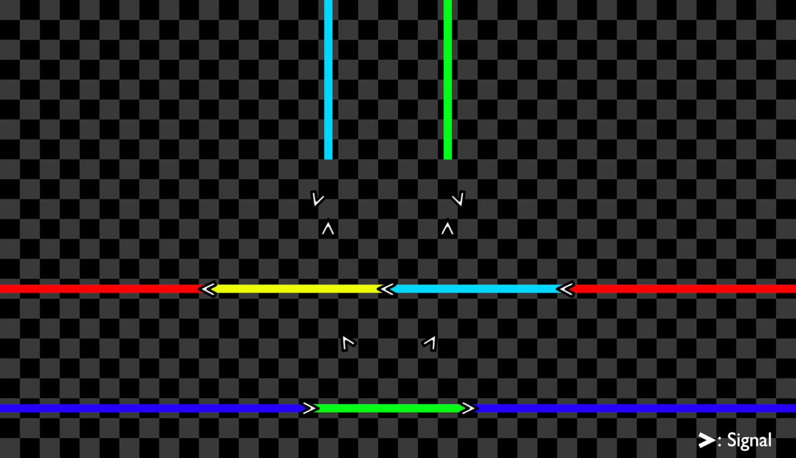

# Track Intersections

This section covers intersections of tracks, including junctions,
crossovers, and others.

## Crossovers

Crossovers allow a train traveling in one direction to move to the track
going in the opposite direction, effectively turning around while keeping
track directions correct.

Below is the design used for crossovers on ELR lines.

This image shows a simple process for constructing such a crossover.

## Junctions

Junctions merge two or more lines together, allowing trains to cross to
other lines. These are used when joining side routes with the main line,
or when merging two main lines together. On ELR lines, junctions will
usually be 2:2 (two lines to two lines) or 1:2, as the main line is two
lines, and usually either 3-way or 4-way (as in the number of directions
available)

Below is the design of a 3-way junction.

This image shows a process for constructing that junction.

