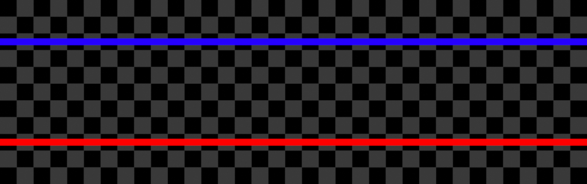
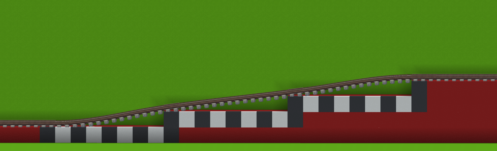
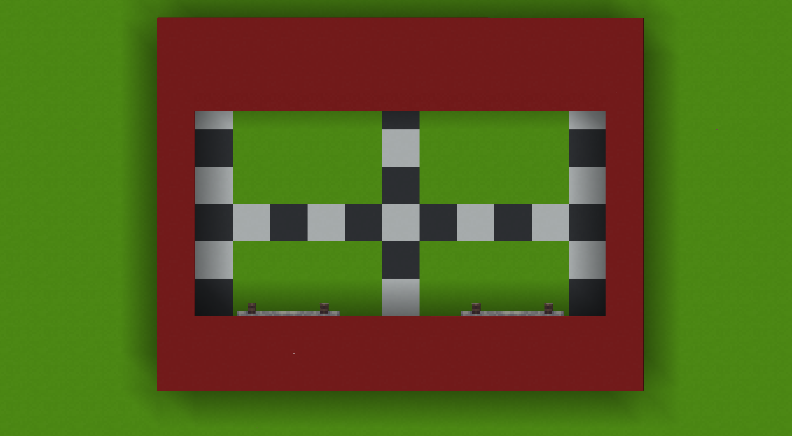
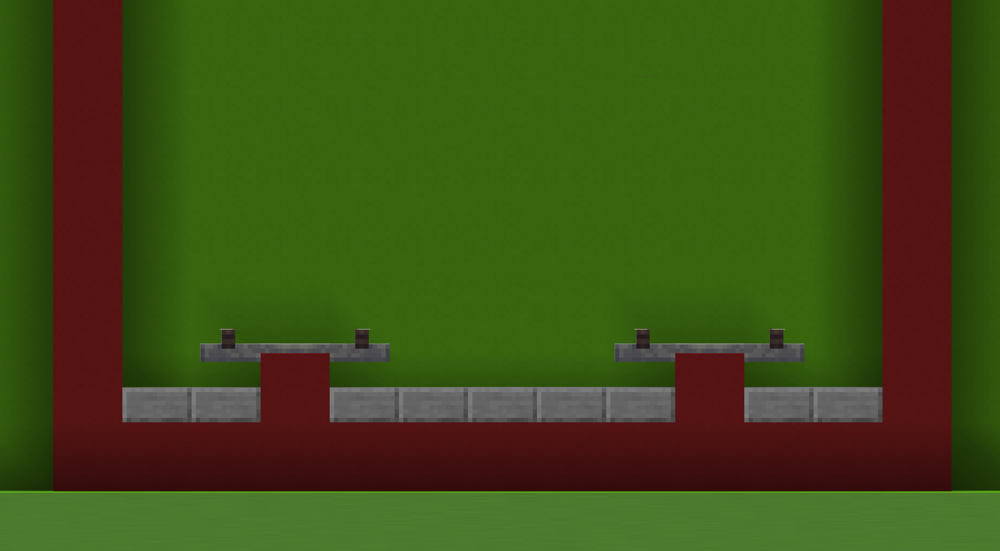

# Track Lines

This section describes general standards for ELR compatible tracks.

## Sizing

For all non-specialized rail, ELR uses medium gauge rail (3m wide). Style
is not standardized; any medium gauge rail will be compatible. Rail should
always have a 1m gap on either side, and when two lines are placed next to
each other, an additional 1m should allocated in between them. These gaps
may be lowered if desired, e.g. [for spawnproofing](#mob-protection). Below is a
diagram displaying this standard.

Lines do not necessarily have to be axis-aligned (running along the X or Z
axis), they may be diagonal or even curved, but the space between lines
should be preserved at all times. If you are unsure if you've given enough
space, err on the side of caution and add some more.

## Positioning

Some ELR lines have specific position requirements to account for their
environment. This section will also list standards for specific terrain,
and some notable stations.

Most importantly, in the Nether ELR lines run at Y=7. This is done to
reduce the burden of protecting the line from the hostile fauna and
terrain which is common in the Nether. To match this height specification,
Overworld-side connections to Nether lines should also be at a similar
height to ensure consistent portal links. The Overworld side does have
looser tolerances; building within 16m vertically should be comfortable,
but this guidance is dependant on how many portals are present in the area.
For an example of this kind of Nether-Overworld connection, End Station
has a Nether connection and is fully built at Y=6.

## Slopes

The grade of ELR slopes should be no more than 12.5% (or 1 meter up for
every 8 meters over). 

Slopes can be built in a straight, as in the above example, or in a [spiral](https://en.wikipedia.org/wiki/Spiral_(railway)),
or [zig-zag](https://en.wikipedia.org/wiki/Zig_zag_(railway)).

## Tunnels

When building a tunnel, the roof of the tunnel must be a minimum of 5.5m
above the floor.

This cross-section shows a tunnel of minimum height. Higher roofs are also
acceptable.

## Mob Protection

All lines should be protected from mobs, hostile mobs especially but
inclusive of all mobs. It's important lines remain clear of obstacles,
especially living ones, to avoid casualties.

In the Overworld, this can be accomplished by a combination of lighting
and fencing. Lighting to prevent hostile mob spawns, and fencing to
prevent other mobs wandering onto the tracks. Fencing should be at least
three blocks higher than the tracks. If a line is underground, it should
already be enclosed and does not need further fencing.

In the Nether, mob protection is much more difficult. Lighting is no
longer an effective method of mob proofing, so we must turn to
alternatives. Nether lines generally run near bedrock to avoid the hazards
present higher in the Nether (lava, Ghasts) and so usually are enclosed
within tunnels. This prevents mobs from wandering onto the tracks
externally, but does not prevent spawns directly on the tracks. For this
purpose, another method of spawnproofing is necessary. ELR recommends
using slabs (buttons are also an option, but have twice the material cost).
You may also drop the level of the blocks surrounding rails in order to
lower spawnproofing blocks.

Here's an example cross-section of what this could look like.

The most important thing to ensure is that Ghasts cannot spawn. In the
Nether, Ghasts are one of the biggest threat to a railway due to them
being able to break blocks.

If you must travel on the surface of the Nether, similar guidelines apply.
Be sure to have effective fencing where necessary. Spawnproof the roadbed
using a technique mentioned here or another effective method. When
travelling on the surface, you also must build a roof over the tracks to
protect against Ghasts. Nether surface lines should effectively be tunnels.