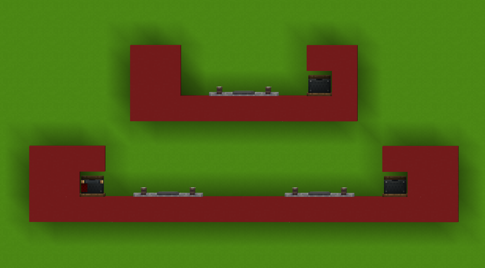

# 2.4: Track Stations

This section describes how to design stations for ELR lines. There are two
types of stations used along ELR lines: dedicated and inline stations.

## 2.4.1: Dedicated Stations {#m-2-4-1}

Dedicated stations are the most common type of station, and the most
versatile.

Stations should follow the footprint requirements for general ELR lines,
leaving a 1m gap either side of the track and having a minimum height
of 5.5m. Below is an example station cross-section.

A station which accepts freight should have its interfaces placed 18m
away from the station. Below is an example.

The astute viewer may notice that there are three interfaces placed in
this example. A single ELR compliant station may have up to three
storage interfaces associated with it. This allows for three different
storage operations to take place at once, at a single station. The
interfaces may or may not be different types, but due to the [requirements of ELR compliant freight cars](../trains/constraints#m-1-1-2),
a single station may work with several different types of cargo. This
is an incredibly powerful capability that makes designing versatile
stations much simpler.

## 2.4.2: Inline Stations {#m-2-4-2}

Inline stations are more uncommon, and for good reason. They are added
onto the line itself, which comes with several problems, most notably of
which: slowing traffic. However, inline stations may still be useful in
low-traffic regions, or when building a dedicated station would be too
impractical. Inline stations should be freight-only stations.

Inline stations should follow the same requirements as dedicated stations
regarding distance to interfaces, but other than that requirement the
primary concern is placing signals effectively. There should be a signal
just ahead of the station, several meters forward of the train at rest,
as well as a signal behind the last expected carriage of the train. If the
length of the trains you expect to see at your station is unknown, ensure
that your signal placement encompasses the longest train you believe
likely with plenty of extra space besides. Poor signal placement is the
primary cause of rail collisions, ensure your station does not fail this.