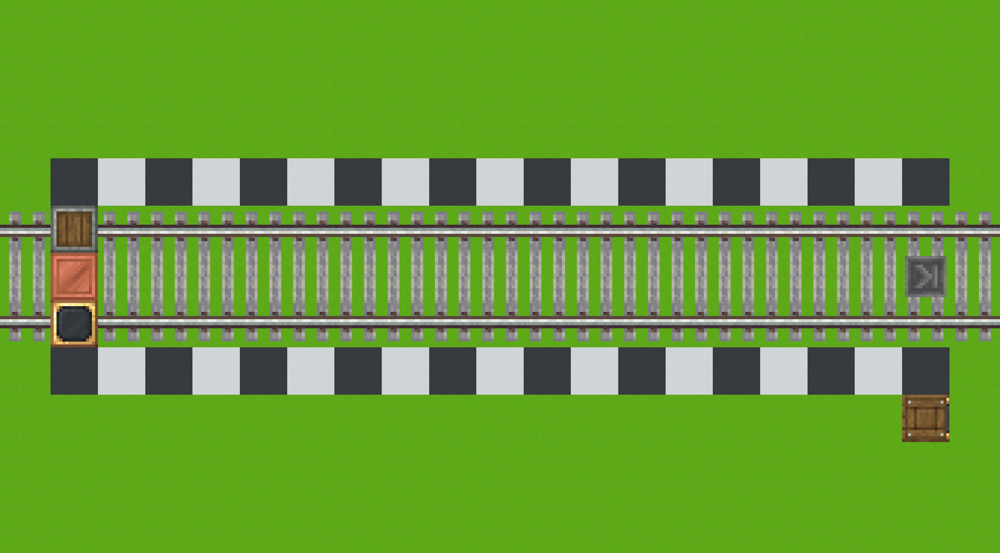

# 1.1: Train Constraints

This section describes the constraints that ELR-compliant trains should
adhere to.

## 1.1.1 Train Length {#m-1-1-1}

Generally, trains may be of any reasonable length. The primary factor to
consider in train design is the stations the train is expected to visit.
However, the designer should also be aware of the risk of self-collision.
ELR track should never be laid in a way to allow self-collision without an
impractically long train, but some single-track lines or smaller stations
may not be able to accommodate an exceedingly long train. Plan ahead for
the stations your train will visit, and the route it will take to those
stations. To play it safe, stay under 50m long.

## 1.1.2 Storage Interfaces {#m-1-1-2}

In order to maintain compatibility with [ELR stations](../tracks/stations#m-2-4-1),
a trains storage interfaces should lie 18m from the station it is
stopped at.

The carriage must be equipped with 3 storage interfaces. ELR stations may
make use of any one (or multiple) of these interfaces, so the train
designer must be prepared with all three. This constraint allows a single
ELR station to process three different kinds of goods at once.