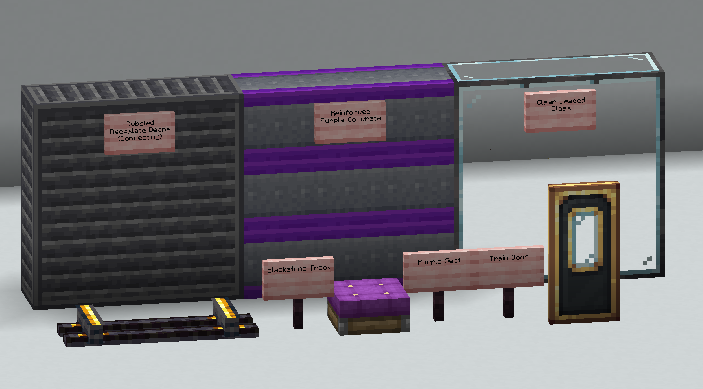
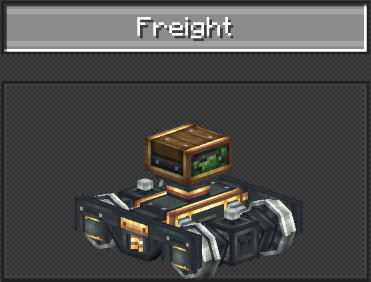
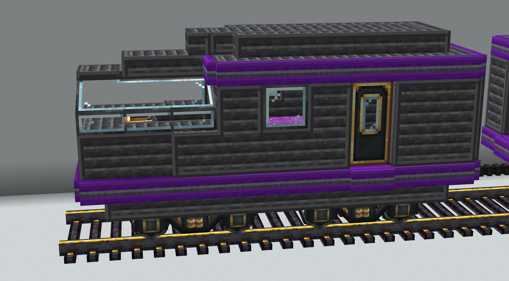
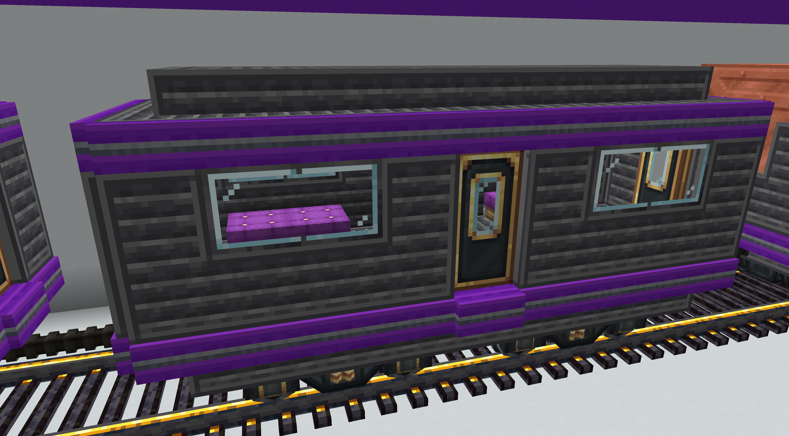
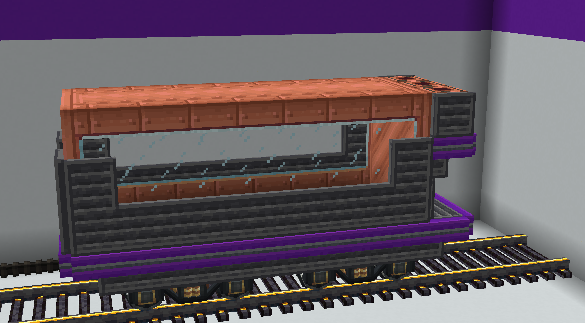

# 1.2: Train Styles

The ELR Manual is focused on the practicality of design for rail, and does
not provide aesthetic guidance. However, there are some standard styles in
use by various organizations and individuals on ELR lines, including ELR
itself. This section of the manual documents these styles, not for the
purpose of standardization, but rather to inform, and perhaps, to inspire.

## 1.2.1: ELR {#m-1-2-1}

### Palette

ELR uses a standardized palette in its designs for both train and track.

The primary block used in ELR trains is Cobbled Deepslate Beams
(Connecting). Reinforced Purple Concrete is used as an accenting block,
and Clear Leaded Glass is used where glass is needed. Purple Seats are our
choice of seat, and Train Doors our choice of door. ELR uses Blackstone
Track for its track. ELR also has a standardized bogey, the Double Axle
Freight bogey (standard gauge only).

### Locomotive

ELR has one locomotive design used for all its trains, passenger and
freight alike.

The locomotive is largely made of our primary block in thin panels, with a
wide window for the operator that is slanted on the sides, giving the
operators seat a full 180° field of view. Running in a ring at the top and
bottom of the locomotive there is a strip of our accent block. The lower
one of these strips is slightly extruded from the body,  making it
possible for one to cling to the side of the locomotive in case of
emergency. There is also a lip extending from the door, making it easier
for passengers to board. Internally, there is a single operators seat and
controls, along with four additional seats. This extra seating gives all
ELR trains the capability of taking passengers if necessary, even along
exclusively freight routes. There are three doors, one on either side
towards the rear, and an additional door on the back for traversing
between carriages. The locomotive, like all ELR rolling stock, is
symmetric, aiding in construction and allowing dynamic station
configurations.

### Passenger Car

The ELR passenger car is a simple but comfortable design, both easy to
build and highly capable.

Like the locomotive, the ELR passenger car is constructed from thin panels
of our primary block, leaving the interior with plenty of space. There are
two strips of our accent, matching our locomotive. The passenger car has
larger windows, giving each passenger a window through which to enjoy the
journey. Inside the carriage, there are four seats, leaving a comfortable
gap for traversing the car. There are four doors, one at the center of
each side. The passenger car is symmetric, with an additional dimension of
symmetry allowing the car to be coupled from either side.

### Freight Car

The ELR freight car uses a standardized design suitable for any type of
cargo.

The ELR freight car is based on a supportive frame wrapped around a
storage container, with an attached storage interface. This design allows
the car be easily reconfigured by simply lifting out the storage container <!-- if only there was a way to actually like, crane a shipping container out of the train car. that would be fucking sick - end -->
and replacing it with one of a different type, along with replacing the
interfaces with the appropriate type (although, ELR station design
standards does allow you to use multiple types of interfaces on a single
car). The car reserves 8m for the storage container, meaning 72m3
of space is available for storage (equivalent to 576B of fluid). The rear
of the car is used for the storage interface, along with a small ledge
should an engineer need access to the rear of the car.